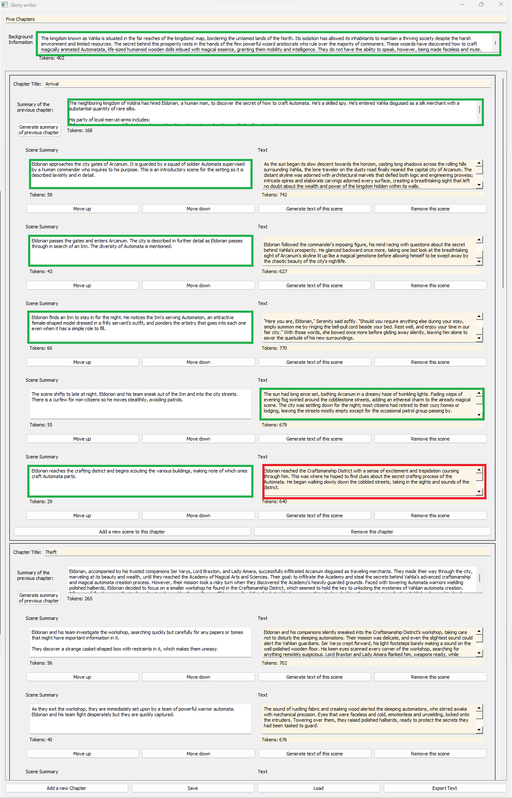

# storyteller
A simple framework for using a local Koboldcpp LLM to help with story-writing

This application uses PyQt to provide an interface to a local [Koboldcpp](https://github.com/LostRuins/koboldcpp) instance that's designed to make story-writing easier to keep organized and make good use of a smaller context size than the story can fit into.

It divides the story up into chapters, and scenes within those chapters, and when generating the text for scenes it combines the text and summaries of previous scenes and chapters to hopefully provide the salient details needed for the current scene to generate well.

The following shows what is included in the prompt (outlined in green) that is used to generate a scene's text (outlined in red). In a nutshell:

* The background information is always included first.
* Each "previous chapter" summary is included.
* The summary of each previous scene in the current chapter is included. Scene summaries from previous chapters are not included, it is expected that all salient information from them is contained in the "previous chapter" summary following it.
* The summary of the scene immediately prior to the current one is not included, instead the complete text of the previous scene is included.
* Finally, the summary of the current scene is used to tell the LLM what it is supposed to write about in the current scene.

